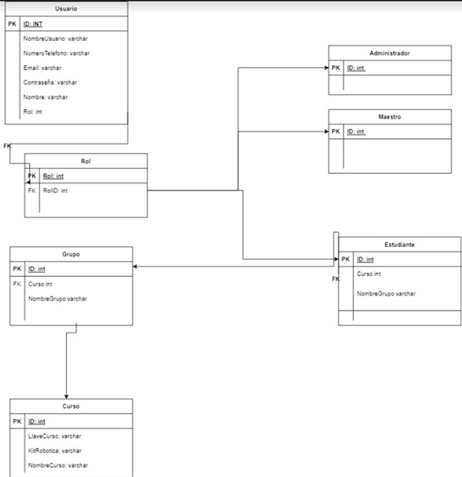

# ACTIVIDAD-7

## Descripcion del proyecto

En esta actividad desarrollo el uso de controladores, modelos y migraciones donde utilice la base de datos phpMyadmin y junto con pude migrar mis datos a la base luego en la tarea 6 utilice seeder, factorys y fakers donde su uso es agregar datos ramdom.

